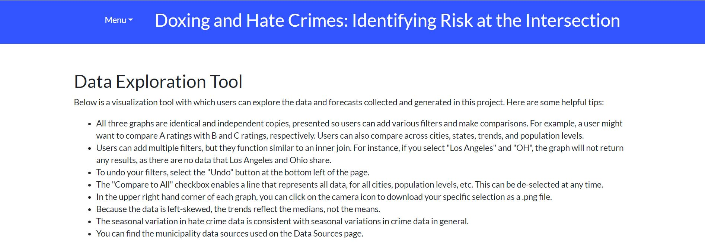
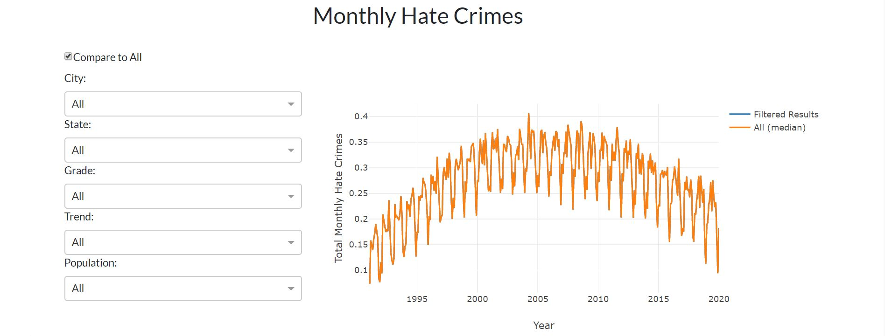

# Doxing and Hate Crimes: Identifying Risk at the Intersection

# Abstract

This project explores the intersection of the risks from doxing and hate crimes. The aim of our work is to highlight the greatest vulnerabilities that exist in data protection for victims, witnesses, or suspects of crimes—specifically, hate crimes—and provide some recommendations from best practices that public officials can implement to close the gap. Because there are no mandated regulations governing the public release of police reports in the US, a wide spectrum of data protection exists from municipality to municipality. We created a data set of 276 municipalities--those with at least 100,000 people, and graded each to assess the ease of access to sensitive information about victims, witnesses, or suspects. Then, we conducted a time series forecast to identify hate crime trends for each municipality. Combining the two dimensions quickly spotlights which cities are publicly releasing direct identifiers for victims of crimes and also possess a forecasted increase in hate crimes over the next two years, creating a sense of urgency to close the data vulnerability gap. This information will be shared with local government officials as a catalyst to create reform in the way municipalities share sensitive data with the public.

# Live App

We developed our models in Python, using Prophet for time-series forecasts, and deployed our results as a live app via Heroku, using Plotly Dash to create visualizations. Users can explore the full methodology, visualization tools, and data sources through the live app, which is hosted at https://hatecrimes.herokuapp.com/.

# Live App Snapshot

  
  

